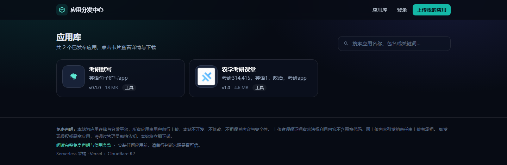
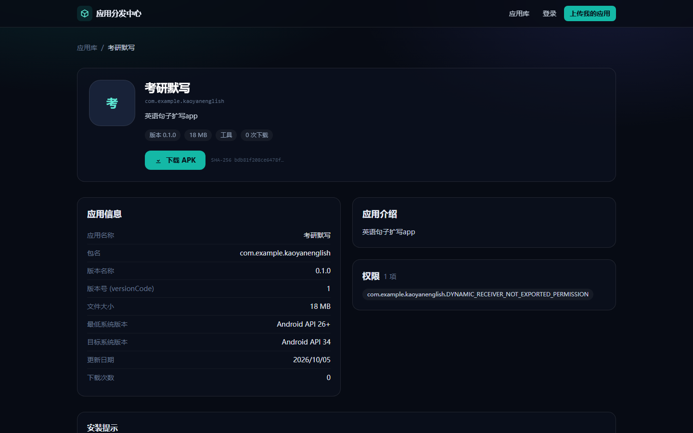
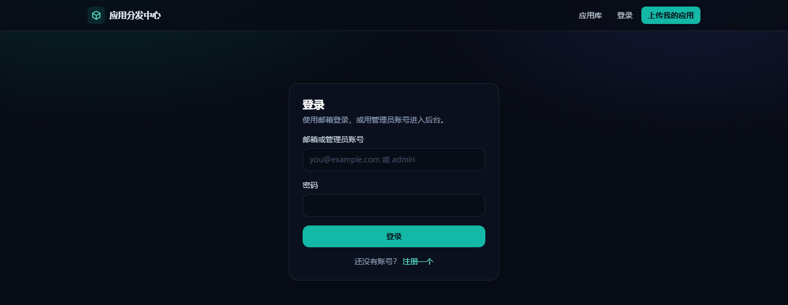
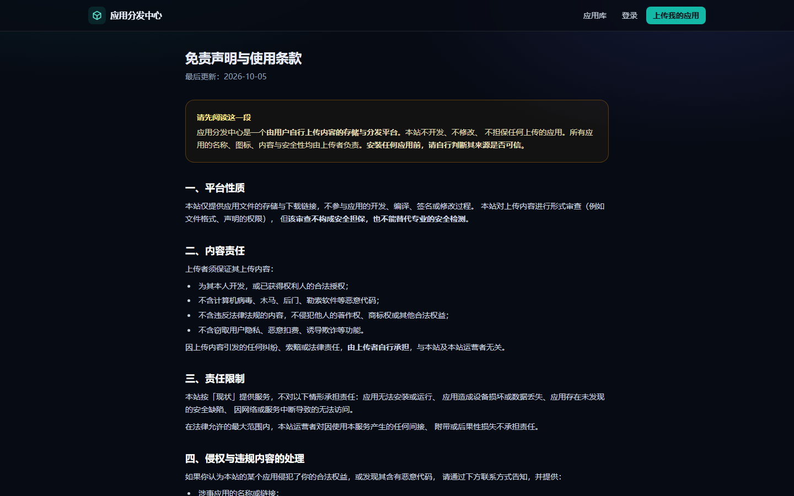

# APK 分发平台

一个**零服务器维护**的应用分发站点，跑在免费额度内：用户注册后上传 APK / HTML 应用，管理员审核通过后公开，访客可浏览、搜索、下载。

为「AI 生成的 app 想分享给别人用」这个场景而写，所以重点解决三件事：**上传要扛得住大文件**、**下载不能烧钱**、**开放上传不能变成垃圾场**。

---

## 界面

| 应用库（访客） | 应用详情 |
| --- | --- |
|  |  |

| 登录 | 免责声明与使用条款 |
| --- | --- |
|  |  |

> 截图取自实际运行的站点。上传后的元数据（应用名、包名、版本、权限、图标）
> 全部由解析器从 APK 中读出，上图中的「考研默写」没有任何字段是手填的。

---

## 它解决的具体问题

| 问题 | 做法 |
| --- | --- |
| Vercel 请求体上限 4.5 MB，APK 动辄上百 MB | 浏览器**直传对象存储**，函数只处理几百字节的 JSON |
| 下载走函数转发会烧光带宽额度 | 下载返回 **302 跳转**直达对象存储，函数只回几百字节 |
| 用户上传的 APK 要填一堆元数据 | **自研零依赖解析器**自动读出应用名、包名、版本、权限、图标 |
| 开放上传会被垃圾/恶意应用淹没 | **注册 + 审核队列 + 自动初筛**三层 |
| 想禁止联网应用却管不住 | 服务端**把文件读回来重新解析**，不信前端提交的数据 |

---

## 功能

**访客**：浏览、搜索、看详情（截图 / 权限 / 版本）、下载 APK（支持断点续传）、在线运行 HTML 应用。

**注册用户**：上传 APK / HTML，查看自己每个应用的审核状态与驳回理由，编辑或删除自己的应用。

**管理员**：审核队列（通过 / 驳回并填理由）、管理全部应用、用户管理、配额与权限规则配置。

---

## 技术选型

| 层 | 选型 | 为什么 |
| --- | --- | --- |
| 前端 + 后端 | Next.js 16（App Router） | 一个项目同时提供页面和 API |
| 数据库 | PostgreSQL（Neon / Vercel Postgres） | 表结构在首次访问时自动创建，无需迁移步骤 |
| 文件存储 | Cloudflare R2 | **出网流量免费**，这是它胜过 Vercel Blob 的关键 |
| 样式 | Tailwind CSS v4 | 无运行时开销 |
| 运行时依赖 | 6 个 | 冷启动快、攻击面小 |

---

## 亮点：自研的 APK 解析器

上传 APK 时会自动读出**应用名称、包名、版本号、版本代码、所需权限、最低/目标系统版本**，并**提取启动图标**。

由 `src/lib/apk/` 下约 400 行、**零依赖**的解析器实现，直接解码 APK 内部的三种二进制格式：

- `zip.ts` — 读取 ZIP 中央目录，按需取用成员（配合 HTTP Range，不下载整个 APK）
- `axml.ts` — 解码编译后的二进制 `AndroidManifest.xml`
- `arsc.ts` — 解码 `resources.arsc`，把 `@ref:7f0e0001` 这类引用还原成真实的应用名与图标路径

> **为什么不用现成的 `app-info-parser`？** 它的 `isBrowser()` 实现是
> `typeof process === 'undefined'`，在 Next.js 客户端打包时 `process` 会被 polyfill，
> 导致它误判为 Node 环境去 `require('path')` 而崩溃；且它解包后 3.68 MB。
> 自研版本体积以 KB 计，且同一份代码既能跑在浏览器（解析本地文件），
> 也能跑在 Node（对对象存储做 Range 读取，用于服务端复核）。

**验证方式**：自带编码器合成 APK，再断言解析器能精确还原——往返测试。
覆盖 UTF-8 / UTF-16 字符串池、**raw deflate 与 stored 两种压缩**、稀疏资源类型块、
资源引用解引用、密度选择，以及各种损坏输入的降级行为。

```bash
npm run test:apk     # 13 项
```

> 这套测试抓到过一个真实的坑：ZIP 用的是 **raw deflate**（RFC 1951），
> 而最初的实现用了 `DecompressionStream("deflate")`（zlib 格式，RFC 1950），两者不兼容。
> **因为测试样本也用了错误的格式，两边一致所以测试通过**，而真实 APK 全部解析失败，
> 浏览器只报一句含糊的 `Failed to fetch`。现已用真实格式做样本，并保留 zlib 回退。

---

## 安全模型

### 上传：信任边界在服务端

前端提交的元数据**不可信**。要用于策略判断的事实（尤其是权限清单）由服务端
**把文件从对象存储读回来重新解析**得到：

```
浏览器 ──① 请求预签名地址──► /api/apps/presign      （几百字节 JSON）
浏览器 ──② PUT 直传────────► Cloudflare R2          （文件本体，不经过服务器）
浏览器 ──③ 提交元数据──────► /api/apps
                                  │
                                  └─ 服务端 Range 读取文件（数百 KB）
                                     重新解析权限 → 应用筛查规则
```

### 审核：自动初筛 + 人工决定

```
提交 ──► 硬规则检查 ──► 违规直接拒绝（中文理由返回给提交者）
          │
          └─► 风险评分 ──► 进入审核队列 ──► 管理员通过 / 驳回
```

**自动初筛能做什么**：权限风险评分（短信、无障碍、设备管理等 20 项）、签名块检查、
字节码字符串扫描（`DexClassLoader`、`Runtime.exec`、`su`、`SmsManager` 等 12 类特征）、
以及**前端提交的权限与文件实际权限不一致**的篡改检测。

**它做不到什么**（重要）：**这不是杀毒软件。** 它只能识别已知特征，
检测不出新型恶意软件、混淆过的代码，或运行时动态下发的载荷。
真正的杀毒需要 VirusTotal（外部服务）或 ClamAV（需要常驻进程，Serverless 跑不了）。

**请把它当分诊台，不是安检门。** 界面上也是这么标注的。

### 权限：谁能做什么由服务端强制

| 操作 | 访客 | 注册用户 | 管理员 |
| --- | --- | --- | --- |
| 浏览 / 下载已发布应用 | ✅ | ✅ | ✅ |
| 获取上传地址 | ❌ | ✅ | ✅ |
| 修改应用 | ❌ | 仅自己的 | 全部 |
| 决定是否公开 | ❌ | **永远不行** | ✅ |
| 审核 | ❌ | ❌ | ✅ |

规则写在 API 路由里，不是靠界面隐藏按钮。测试里有对应的断言。

---

## 快速开始

```bash
npm install
npm run dev          # http://localhost:3000
```

不配置任何环境变量也能跑：数据在内存、文件不可上传，适合先看界面。

### 部署上线

需要 **Neon**（数据库）、**Cloudflare R2**（存储）、**Vercel**（托管），都在免费额度内。

```bash
npm run doctor              # 自检：真实连一次数据库和 R2
npm run deploy -- --prod    # 部署（会打开浏览器让你登录 Vercel）
```

完整的中文分步手册见 **[README-DEPLOY.md](./README-DEPLOY.md)**，面向非开发者，约 15 分钟。

> **别跳过 R2 的 CORS 配置。** 漏掉这一步网站能打开、能登录，
> 但上传时浏览器只报一句 `Failed to fetch`，极难排查。手册里有专门一节。

---

## 环境变量

必需项见 [.env.example](./.env.example)：数据库连接串、4 个 R2 值、管理员凭据。

可调项：

| 变量 | 作用 | 默认 |
| --- | --- | --- |
| `BLOCKED_PERMISSIONS` | 禁止上传的权限，逗号分隔；留空取消限制 | `INTERNET` |
| `MAX_APPS_PER_USER` | 每账号最多提交几个应用 | `10` |
| `MAX_UPLOAD_MB` | 单文件上限（MB） | `200` |
| `MAX_SIGNUPS_PER_HOUR` | 同 IP 每小时注册上限 | `15` |
| `MAX_DEX_SCAN_MB` | 字节码扫描的大小上限（MB） | `25` |
| `DISABLE_REGISTRATION` | 设为 `true` 关闭公开注册 | 未开启 |

---

## 命令

| 命令 | 作用 |
| --- | --- |
| `npm run dev` | 本地开发 |
| `npm run build` | 生产构建 |
| `npm run typecheck` | 类型检查 |
| `npm run doctor` | 配置自检（真实读写数据库与 R2） |
| `npm test` | 解析器 + 签名测试（离线，共 32 项） |
| `npm run test:apk` | APK 解析器往返测试（13 项） |
| `npm run test:sign` | SigV4 签名测试（19 项） |
| `npm run test:live` | 线上单管理员全链路（24 项） |
| `npm run test:users` | 线上多用户 + 安全边界 + 自动筛查（29 项） |
| `npm run secret-scan` | **提交前检查：确保没有密钥被误提交** |
| `npm run cleanup:tests` | 清理端到端测试产生的账号与数据 |
| `npm run r2:cors` | 检查 R2 的 CORS 是否配置正确 |
| `npm run r2:list` | 列出存储桶内的对象 |
| `npm run inspect-apps` | 列出所有应用及其权限（改规则前先看影响面） |
| `npm run admin:hash` | 生成管理员密码哈希 |
| `npm run deploy -- --prod` | 部署到 Vercel |

---

## 项目结构

```
src/
  app/
    page.tsx                      首页：搜索 + 应用网格
    app/[slug]/page.tsx           应用详情：截图、权限、下载
    login/  register/             登录与注册
    dashboard/                    用户后台：我的应用
    admin/                        管理后台：审核队列 + 全部应用
    terms/                        免责声明与使用条款
    download/[slug]/route.ts      下载：302 直达对象存储
    view/[slug]/route.ts          HTML 应用内联运行（受限沙箱）
    api/apps/                     应用 CRUD、预签名、审核
    api/auth/register/            注册
    api/media/[slug]/[asset]/     图标与截图
  components/admin/               后台界面组件
  lib/
    apk/{zip,axml,arsc,manifest}.ts   零依赖 APK 解析器
    screening.ts                      筛查规则引擎
    screening-server.ts               服务端文件复核
    r2.ts                             手写 SigV4（未引入 AWS SDK）
    storage.ts                        R2 / 内存双后端
    db.ts                             数据访问 + 自动建表迁移
    auth.ts                           双角色会话
    net.ts                            带重试的 fetch
scripts/                          部署、自检、测试、密钥扫描
```

---

## 已验证 / 未验证

**已实测通过**（共 32 项离线 + 53 项线上）：

- 生产构建、类型检查 0 错误
- APK 解析器 13 项：UTF-8/UTF-16 字符串池、raw deflate 与 zlib 回退、稀疏资源块、
  图标密度选择、资源引用解引用、损坏文件降级
- SigV4 签名 19 项：密钥派生链、规范化请求结构、URI 转义、确定性与敏感性
- 线上单管理员全链路 24 项：上传 → 发布 → 搜索 → 下载（302）→ 内容逐字节比对
- 线上多用户 29 项：注册、配额、**提交时伪造 published 被忽略**、
  **声明联网权限被拦截**、**跨用户修改/删除被拒**、**普通用户无法自审**、
  管理员覆盖规则仍留痕、驳回附理由

**未验证**：

- 对**真实世界各种 APK** 的解析覆盖率。解析器用合成样本严格验证过，
  但真实 APK 可能有非标准结构；界面上所有字段都可手动修正，不会阻塞上传。
- 杀毒能力。**没有**，见上文「安全模型」。

---

## 已知限制

- **只做 Android**。iOS 的 `.ipa` 需要不同的解析逻辑（plist 而非 AXML）。
- **不支持增量更新（Split APK / AAB）**。可以上传 `.apks`/`.xapk`，但站点只原样分发，不负责合并安装。
- **未做应用签名校验**。展示的 SHA-256 只是文件摘要，不等于验证了签名证书。
- **注册没有邮箱验证**。因此也没有自助找回密码；管理员需手动重置。
- **限流是基于单实例内存的**。它是挡住脚本化滥用的减速带，不是精确配额。

---

## 使用前请知悉

这是一个**用户上传内容的存储与分发平台**。公开运营前请确认：

- 你有能力对上传内容进行审核（审核队列需要有人处理）
- 你清楚分发他人应用可能涉及的著作权风险
- 站内已内置免责声明（`/terms`），但仍建议根据你的实际情况调整

代码以 MIT 许可发布，不构成任何法律意见。

---

## 许可

[MIT](./LICENSE)
